# Docker
---
## Table of Contents

- [Basics of Docker](intro.md)
- [Docker Engine Installation](#docker-engine-installation)
- [Docker Desktop Installation](#docker-desktop-installation)
- [Building a website on Nginx](#building-a-website-on-nginx)
- [Docker Images](dockerimage.md)
- [Docker Volumes](docker-volume.md)
- [Docker Network](dockernetwork.md)
- [Dockerfile](dockerfile.md)
- [Docker Compose](docker-compose.md)
- [Docker Swarm](docker-swarm.md)
- [Docker Stack](docker-stack.md)
- [Docker Commands all](docker-commands.md) 
---
# What is Docker
Docker is a software platform that simplifies the process of building, running, managing and distributing applications. It allows you to bundle an application with everything it needs, such as libraries and dependencies, into a single container. This container can then be run on any system that supports Docker, without needing to change the host system. The machine on which Docker is installed and running is usually referred to as a Docker Host or Host. <br>     
Docker containers are often described as "lightweight" because they don't have a full operating system running inside them. Instead, they share the host operating system's kernel but isolate/ virtualize their processes, file systems, and network interfaces in such a way that it feels as if they are running in their own environment. Whereas the kernel of the host’s operating system is shared across all containers.

#### Important Note
`Linux containers` can run on Linux, macOS (via Docker Desktop), and Windows (via WSL2).           
`Windows containers` run only on Windows hosts, using Windows-based images
### Docker Key Terms

1. **[Docker Images]**:     
   A `Docker image` is a lightweight, standalone, and executable package that contains everything needed to run a piece of software. It includes the application code, libraries, dependencies, environment variables, configuration files, and more, all bundled into a single image.
2. **Docker Containers**:    
   These are live instances of images. They run in their own isolated environment, sharing the host’s core system, but remaining lightweight and portable.
3. **[Dockerfile]**:             
   A Dockerfile is a text file with a series of commands for creating an image.
4. **Docker Volumes**:           
   Used for storing data that you need to keep, even if the container restarts or deleted.
5. **Docker Engine**:           
   The core component that runs and manages Docker containers, consisting of the Docker daemon, REST API, and the Docker CLI.
   
## Docker Architecture
Docker uses a client-server architecture. The Docker client talks to the Docker daemon, Docker client and daemon can run on the same system, or you can connect a Docker client to a remote Docker daemon. <br>

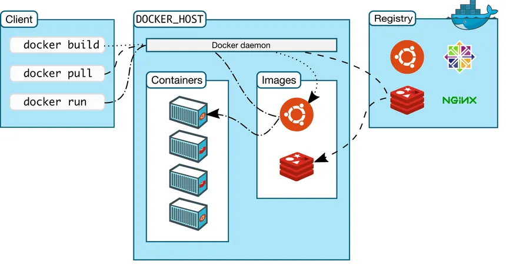  <br><br><br>

**Docker Engine**:        
   The Docker Engine is the heart of the Docker platform. It comprises two main components which are `Docker Client(CLI)` and `Docker Daemon`.
   
**Docker Client**:          
   The Docker client is the interface through which users interact with Docker. It can be a command-line interface (CLI) or a graphical user interface (GUI). The client sends requests to the Docker daemon (server) via REST API to build, run, and manage containers. It can be on the same machine as the Docker daemon or on a remote system.              
   The REST API specifies how the applications can interact with the Server, and instruct it to get their job done.

**Host**:         
   The Docker host is the machine (physical or virtual) that runs the Docker daemon.It is responsible for building, running, and managing containers.

**Registry**:             
   A registry is a storage system for Docker images. Docker Hub is the default public registry, but private registries can also be used. The registry stores Docker images, which are used to create containers. The Docker client can pull images from the registry or push images to it.

## Docker Container Lifecycle
Docker containers complete life cycle are managed by Docker Daemon.

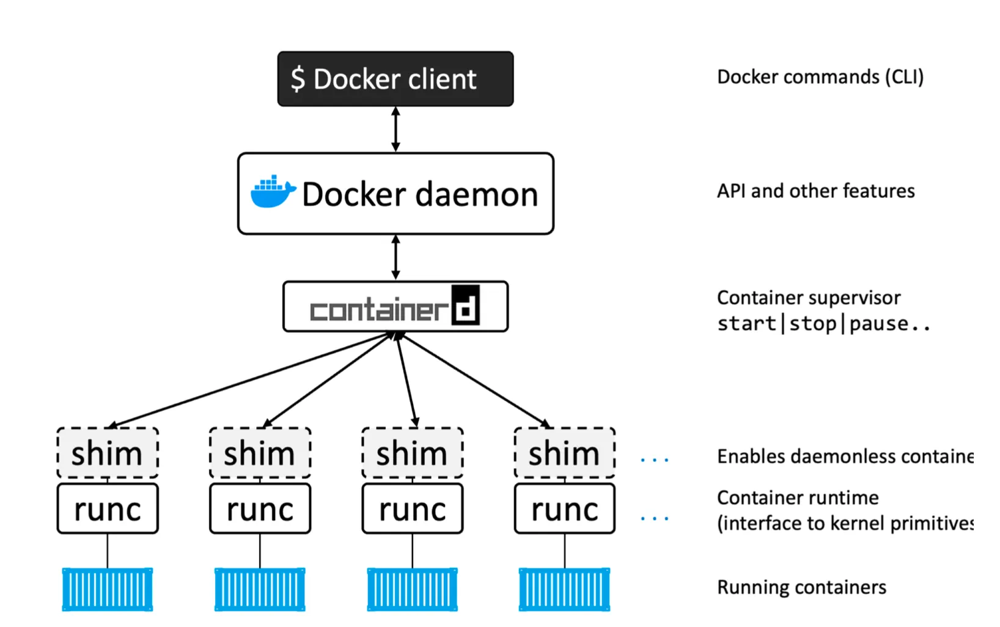  <br><br><br>

**Docke-Daemon** (`dockerd`):          
   It is the central server that manages Docker containers. It listens for Docker API requests (from the Docker CLI) and coordinates the container lifecycle. It interacts with `containerd` to manage container creation, execution, and destruction.

**containerd**:            
   It is a high-level container runtime responsible for pulling images, creating container, and managing containers. It communicates with `runc` to start containers and `shim` to maintain their lifecycle.

**runc**:          
   It is a low-level container runtime that sets up the container’s namespaces, cgroups, and other Linux features to ensure process isolation and resource management. It runs the actual container’s process.

**shim**:             
   It is a lightweight tool that ensures the container’s main process stays running, even after the Docker CLI disconnects. It manages logging and other metadata while working with `containerd` and `runc`.

### Docker Engine Workflow:      
Docker CLI sends a command to the Docker Daemon. The Daemon communicates with containerd to manage the container lifecycle. containerd pulls the container image and invokes runc to set up and run the container. shim keeps the container’s process running and ensures logging and metadata are handled. containerd and shim continue to manage the container life until it's stopped/killed.


## Basic Docker Commands

To pull image from Docker-Hub to local host
```bash
docker pull nginx:latest
```
<br>

To create container `nginx` latest version, after pulling image from Docker-Hub (if not locally present), with name tag `my-container` but not start it :
```bash
docker create --name my-container nginx
docker start my-container        # to start container if created before
```
<br>

To create & run container `nginx` latest version. `-d` run in detach mode (foreground):   
```bash 
docker run -d --name my-container nginx
```
<br>

To create & run container `nginx` latest version. `-it` provide interactive `TTY` of container after creating it:
```bash
docker run -itd --name my-container nginx
```
<br>

To create & run container `nginx` latest version. `-p` port map 80 to 8080 port of host:
```bash
docker run -d -p 8080:80 --name my-container nginx
```
<br>

To list all conatiners running
```bash
docker ps

docker container ls
```
<br>

To list all local images
```bash
docker images

docker image ls
```
<br>

To list all containers running & stoped.
```bash
docker ps -a

docker container ls -a
```
<br>    

---
# Docker Engine Installation
Following are steps to install docker engine on Ubuntu linux.
1. Update system `apt` source:
```bash
sudo apt update
```
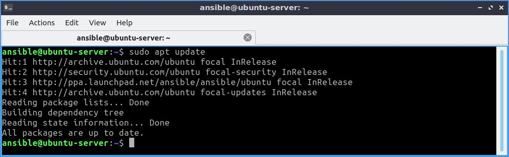   <br><br><br>

2. Add Docker's official GPG key
```bash
sudo apt-get install ca-certificates curl
sudo install -m 0755 -d /etc/apt/keyrings
sudo curl -fsSL https://download.docker.com/linux/ubuntu/gpg -o /etc/apt/keyrings/docker.asc
sudo chmod a+r /etc/apt/keyrings/docker.asc
```               
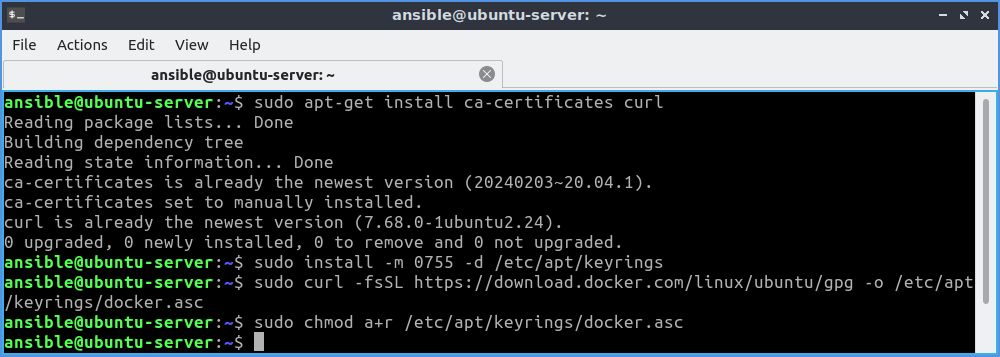   <br><br><br>

3. Add the repository to `apt` sources
```bash
echo \
  "deb [arch=$(dpkg --print-architecture) signed-by=/etc/apt/keyrings/docker.asc] https://download.docker.com/linux/ubuntu \
  $(. /etc/os-release && echo "$VERSION_CODENAME") stable" | \
  sudo tee /etc/apt/sources.list.d/docker.list > /dev/null
sudo apt-get update
```
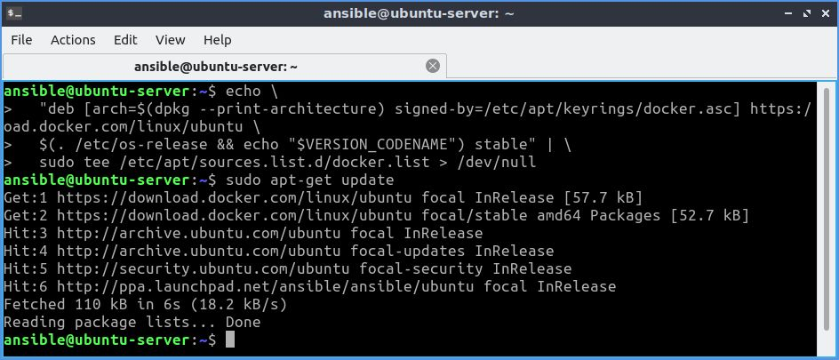   <br><br><br>

4. Install docker engine (complete) with following command
```bash
sudo apt-get install docker-ce docker-ce-cli containerd.io docker-buildx-plugin docker-compose-plugin
```
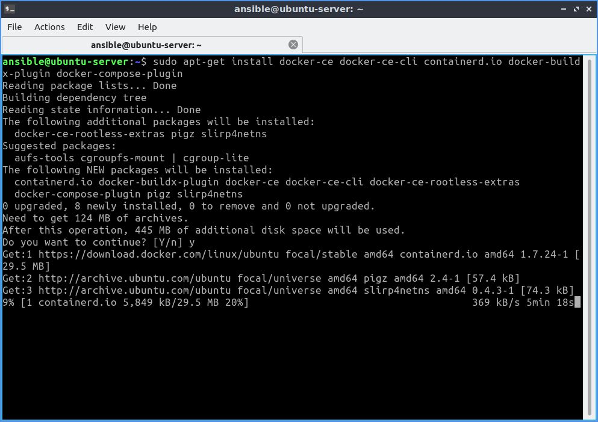   <br><br><br>

                 
5. Verify that the installation by running `hello-world` image:
```bash
sudo docker run hello-world
```
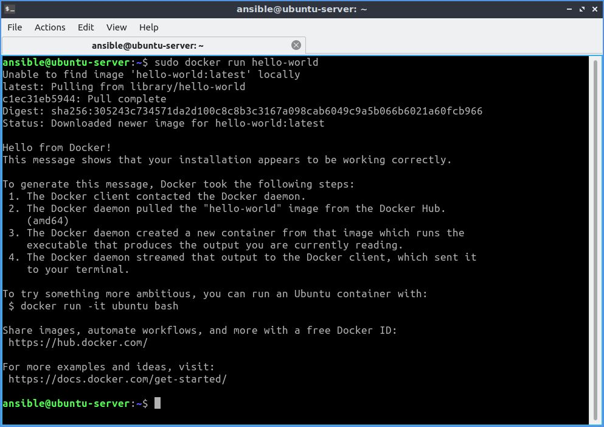    <br><br><br>
       
6. (Optional) Add user to `docker` group to run Docker commands without needing to use sudo everytime.
```bash
sudo usermod -aG docker  <user-name>
```
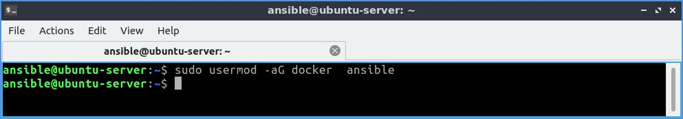   <br><br><br>
Now log out and back log in (or restart system) for the changes to take effect.

---
# Docker Desktop Installation
Following are steps to install Docker-Desktop on any debian based linux system.
1. (i) If you are installing `Docker-Desktop` on system having [Gnome](https://www.gnome.org/) Desktop enviroment you must also install [AppIndicator and KStatusNotifierItem](https://extensions.gnome.org/extension/615/appindicator-support/).                   
   (ii) If you are installing gnome on Debian based system having Desktop enviroment other than Gnome `gnome-terminal` must be installed:
    ```bash
    sudo apt install gnome-terminal
    ```      
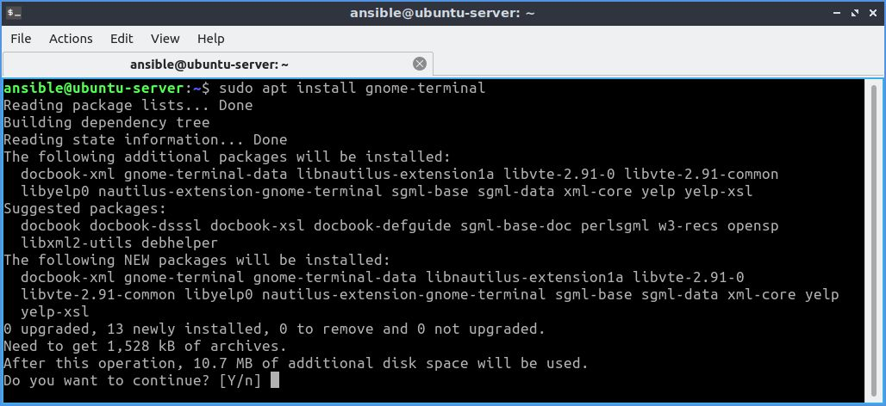   <br><br><br>

2. Set up Docker's apt repository. See step 1 to 3 on [Docker Engine Installation](#docker-engine-installation) section.
3. Download latest version of [Deocker-Desktop.deb](https://desktop.docker.com/linux/main/amd64/docker-desktop-amd64.deb?utm_source=docker&utm_medium=webreferral&utm_campaign=docs-driven-download-linux-amd64).
4. Open terminal in directory where Docker-desktop.deb package is downloaded and run following command.
   ```bash
   sudo apt-get install ./docker-desktop-amd64.deb
   ```        
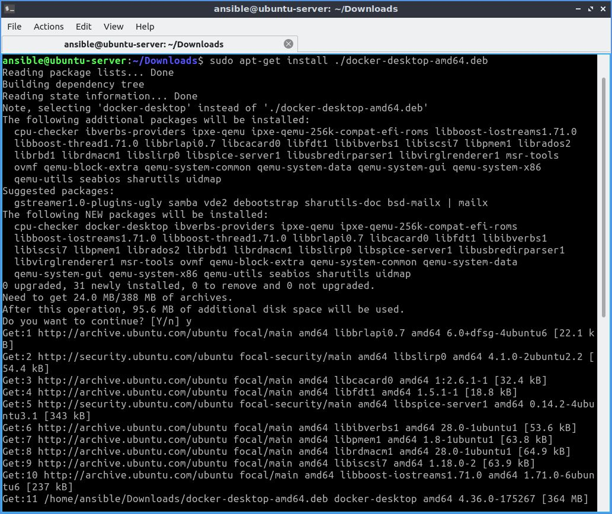   <br><br><br>
5. Open Docker-Desktop through GUI or through following command:
   ```bash
   systemctl --user start docker-desktop
   ```      
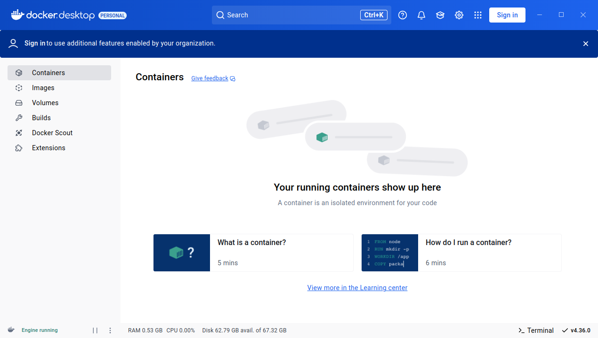        <br><br><br>

---
# Building a website on Nginx

1. Making custom `index.html` for website.
  ```html
  <!DOCTYPE html>
  <html lang="en">
  <head>
      <meta charset="UTF-8">
      <meta name="viewport" content="width=device-width, initial-scale=1.0">
      <title>Simple Page</title>
  </head>
  <body>
      <h1>Welcome to My Website</h1>
      <p>This is a simple HTML page.</p>
  </body>
  </html>
  ```
2. Pulling nginx latest image fron Docker Hub.
  ```bash
  docker pull ngix
  ```
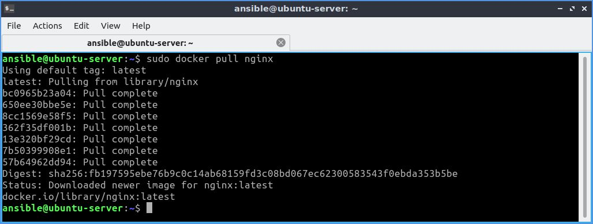         <br><br><br>
2. Building the container from image on port 8000 with custom `index.html`.
  ```bash
  docker run -p 8000:80 -v /home/ansible/nginx:/usr/share/nginx/html -d nginx
  ```
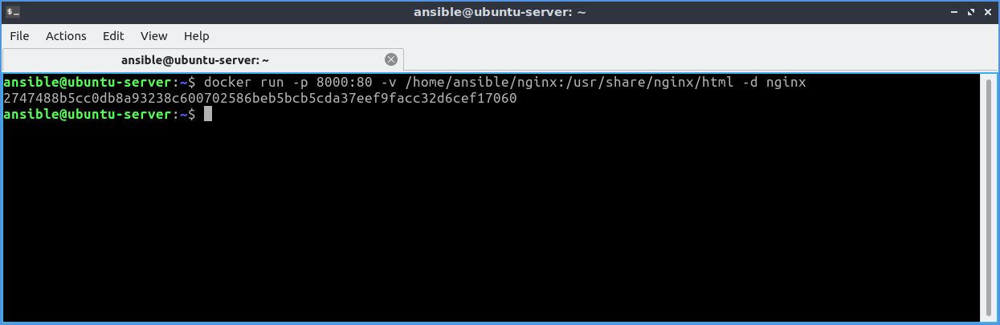     <br><br><br>
3. Verying website by entering `localhost:8000` in browser.         
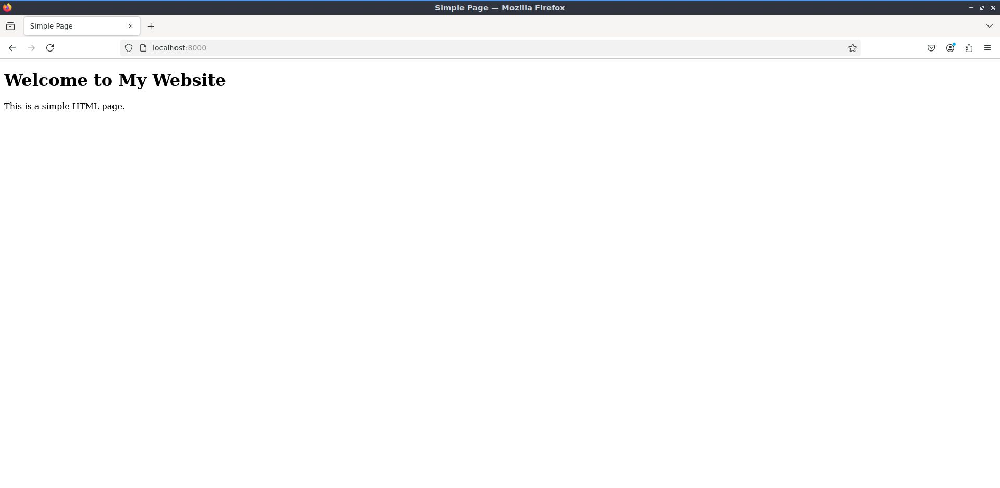     <br><br><br>


