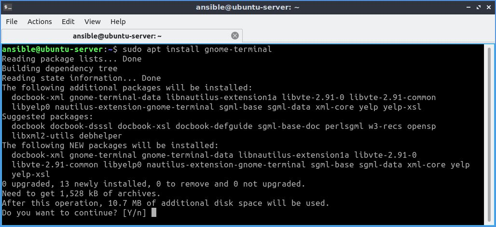

# Docker
---
# Table of Contents

- [What is Docker](#what-is-docker)
- [Docker Engine Installation](#docker-engine-installation)
- [Docker Desktop Installation](#docker-desktop-installation)
- [Building a website on Nginx](#building-a-website-on-nginx)
---
# What is Docker
Docker is a platform that simplifies the development, delivery, and operation of applications by using containers. It allows you to bundle an application with everything it needs, such as libraries and dependencies, into a single container. This container can then be run on any system that supports Docker, without needing to change the host system.

## Docker Key Terms

- **Docker Images**: These are like blueprints for containers, containing everything the container needs, including the operating system, libraries, and application code. You create images using a Dockerfile, and they can be shared or reused.
- **Docker Containers**: These are live instances of images. They run in their own isolated environment, sharing the host’s core system, but remaining lightweight and portable.
- **Dockerfile**: A Dockerfile is a text file with a series of commands for creating an image.
- **Docker Volumes**: Used for storing data that you need to keep, even if the container restarts or deleted.
- **Docker Engine**: The core component that runs and manages Docker containers, consisting of the Docker daemon, REST API, and the Docker CLI.
- **Docker Client**: The command-line interface (CLI) or graphical user interface (GUI) that allows users to interact with Docker, sending commands to the Docker daemon.
- **Docker Daemon**: The background process that manages Docker containers, images, networks, and volumes, and listens for Docker API requests.
- **Docker Host**: The physical or virtual machine running Docker Engine that hosts and runs Docker containers.
- **Docker Registry**: A service or repository for storing and distributing Docker images, such as Docker Hub, where you can pull or push images.
- **Docker Compose**: A tool for defining and running multi-container Docker applications using a YAML file, enabling the orchestration of services.
- **Docker Network**: A virtual network that allows containers to communicate with each other and the outside world in a secure and isolated manner.
- **Docker Ports**: These allow containers to communicate with the host machine or other containers by opening specific channels.
- **Docker Swarm**: Docker’s native clustering and orchestration tool for managing a cluster of Docker nodes (hosts) and deploying multi-container applications.
- **Docker Hub**: A cloud-based registry service for storing and sharing Docker images, where both official and user-contributed images are available.
- **Docker Stack**: A collection of services (containers) defined by a Compose file that can be deployed to a Docker Swarm cluster for easy scaling and management.

## Basic Docker Commands

- `docker run`: Start a new container from an image.
- `docker ps`: View a list of containers that are currently running.
- `docker stop`: Stop a running container.
- `docker rm`: Delete a stopped container.
- `docker build`: Create a new image from a Dockerfile.
- `docker push`: Upload an image to a registry (like Docker Hub).
- `docker pull`: Download an image from a registry.

---
# Docker Engine Installation
Following are steps to install docker engine on Ubuntu linux.
1. Update system `apt` source:
```bash
sudo apt update
```
   

2. Add Docker's official GPG key
```bash
sudo apt-get install ca-certificates curl
sudo install -m 0755 -d /etc/apt/keyrings
sudo curl -fsSL https://download.docker.com/linux/ubuntu/gpg -o /etc/apt/keyrings/docker.asc
sudo chmod a+r /etc/apt/keyrings/docker.asc
```
   

3. Add the repository to `apt` sources
```bash
echo \
  "deb [arch=$(dpkg --print-architecture) signed-by=/etc/apt/keyrings/docker.asc] https://download.docker.com/linux/ubuntu \
  $(. /etc/os-release && echo "$VERSION_CODENAME") stable" | \
  sudo tee /etc/apt/sources.list.d/docker.list > /dev/null
sudo apt-get update
```
   

4. Install docker engine (complete) with following command
```bash
sudo apt-get install docker-ce docker-ce-cli containerd.io docker-buildx-plugin docker-compose-plugin
```
   

                 
5. Verify that the installation by running `hello-world` image:
```bash
sudo docker run hello-world
```
    
       
6. (Optional) Add user to `docker` group to run Docker commands without needing to use sudo everytime.
```bash
sudo usermod -aG docker  <user-name>
```
   
Now log out and back log in (or restart system) for the changes to take effect.

---
# Docker Desktop Installation
Following are steps to install Docker-Desktop on any debian based linux system.
1. (i) If you are installing `Docker-Desktop` on system having [Gnome](https://www.gnome.org/) Desktop enviroment you must also install [AppIndicator and KStatusNotifierItem](https://extensions.gnome.org/extension/615/appindicator-support/).                   
   (ii) If you are installing gnome on Debian based system having Desktop enviroment other than Gnome `gnome-terminal` must be installed:
    ```bash
    sudo apt install gnome-terminal
    ```
   

2. Set up Docker's apt repository. See step 1 to 3 on [Docker Engine Installation](#docker-engine-installation) section.
3. Download latest version of [Deocker-Desktop.deb](https://desktop.docker.com/linux/main/amd64/docker-desktop-amd64.deb?utm_source=docker&utm_medium=webreferral&utm_campaign=docs-driven-download-linux-amd64).
4. Open terminal in directory where Docker-desktop.deb package is downloaded and run following command.
   ```bash
   sudo apt-get install ./docker-desktop-amd64.deb
   ```
5. Open Docker-Desktop through GUI or through following command:
   ```bash
   systemctl --user start docker-desktop
   ```


