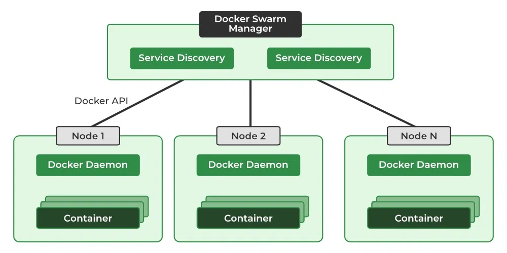

## Docker Swarm

Docker Swarm is a container orchestration (means it manage and coordinates with multiple containers to work together efficiently) tool provided by Docker, allowing us to create and manage a cluster of Docker hosts / nodes, which work together as a single virtual system to deploy and manage Docker containers. 
It is an integral part of Docker's ecosystem for scaling and managing containers in production environments. Each node in docker swarm is `docker daemon` which are interacted by docker API. 
For this Docker uses an overlay network for the service discovery and with a built-in load balancer for scaling the services.

One of the key advantages of docker swarm is that the configuration of the docker services such as volume and network can be modified without the need to manually restart the service.
Docker will update the configuration, stop the service tasks with the out-of-date configuration and create new ones matching the desired configuration.

**Service:** A higher-level abstraction that defines how containers should run across a swarm cluster. It specifies things like the number of replicas, networking, and scaling for an application.

**Task:** A single container instance running as part of a service. Each task is an actual running container, and multiple tasks can be created based on the service's configuration.

When you want to deploy a container in the swarm first you have to create a service. Service consists of multiple task / containers of the same image. 
These services are deployed inside a nodes so to deploy a swarm at least one node has to be deployed. Manager node is responsible for the allocation of the task, dispatch the tasks, and schedule the tasks.

#### Key Banefits of Docker-Swarm

- Docker Swarm assures that our application is always available even if one of the nodes fails by creating the container in another node which is available.
  
- Based on the incoming traffic we can scale the containers up and down by adding to the multiple nodes.    
  
- If there are multiple containers the incoming load will be balanced automatically by the Docker Swarm.    

- Docker Swarm has a number of security features, including traffic encryption between nodes and mutual TLS authentication.    

- Docker Swarm will automatically take care of failed containers and nodes. By this, we can maintain high availability.   

### Docker Swarm Architecture   
There are two types of nodes in Docker Swarm:    
     
<br>
**Manager node:** Cluster can has multiple manager nodes but only one leader, leader mangaer node carries out and oversees cluster-level duties.     
**Worker node:** Receives and completes the tasks set by the manager node.   
A single manager node can be created but the worker node can not be created without a manager node. A manager is also create service task inside him as well.      


### Different Modes of Docker Swarm
Docker Swarm mainly consists of two modes they are:

- **Global Mode:** Runs exactly one instance of the task / container on every node in the swarm, regardless of the number of nodes. Each node gets a task, ensuring that the service is spread across all nodes in the cluster.
 
- **Replicated Mode:** Defines a specific number of container instances (tasks) to run. The number of replicas is specified, and Docker Swarm ensures that exactly that number of tasks are running across the swarm nodes.


To access the service eneter `Manager (Leader) IP` with desired port.

---
### Docker Swarm Creation & Management

- Before creating docker-swarm we need to allow certain network port to open for docker swarm to work with following command:
  
```bash
sudo ufw allow 2377,7946,4789/tcp
```
<br>

- To initialize the docker swarm cluster we use the command called `docker swarm init`.

```bash
docker swarm init
```
<br>

- After this command docker will provide you token to use on nodes to join cluster as worker nodes.
Example:

```txt
docker swarm join --token <token-id> <network-id>:2377
```
<br>

- To check cluster node run following command in `Manager Node`:

```bash
docker node ls
```
<br>

- Creating service with 2 replication in swarm:

```bash
docker service create --name web --publish target=80,published=83 --replicas=2 nginx
```
<br>

- Creating service with 2 replication in swarm:

```bash
docker service create --name ping --replicas=2 alpine ping 8.8.8.8
```
<br>

- Checking running services

```bash
docker service ls
```
<br>

- Inspecting dokcer node

```bash
docker node inspect <node-id>
```
<br>

- Inspecting dokcer service

```bash
docker service inspect <service-name>
```
<br>

- Viewing dokcer service logs

```bash
docker service logs <service-name>
```
<br>

- Scaling running service:

```bash
docker service scale <service-name>=5
```
<br>

- Veiw new overlay networks created by docker-swarm:

```bash
docker network ls
```
<br>

- Viewing dokcer service logs

```bash
docker service rm <service-name>
```
