# Docker Tasks

---

## Task 1
Create an image of a webpage of your choice.You may upload it to Docker Hub.
- Creating `index.htlm`
  ```bash
  nano index.html
  ```
  
  `index.html` content.
  ```html
  <!DOCTYPE html>
  <html lang="en">
  <head>
      <meta charset="UTF-8">
      <meta name="viewport" content="width=device-width, initial-scale=1.0">
      <title>Simple Page</title>
  </head>
  <body>
      <h1>Welcome to My Website</h1>
      <p>This is a simple HTML page.</p>
  </body>
  </html>
  ```    
  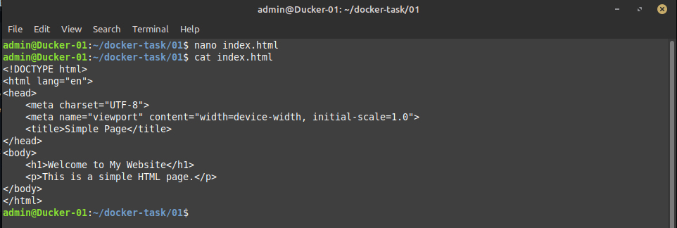
     
- Creating `Dockerfile` for nginx webserver.
  ```bash
  nano Dockerfile
  ```
  `Dockerfile` content:
  ```
  FROM nginx:latest
  MAINTAINER tariq
  COPY . /usr/share/nginx/html/
  ```
  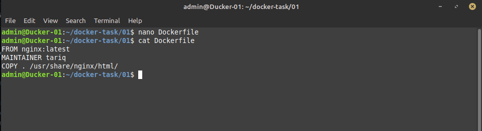

- Builtiding image name `webserv:v1`
  ```bash
  docker build -t webserv:v1 .
  ```
  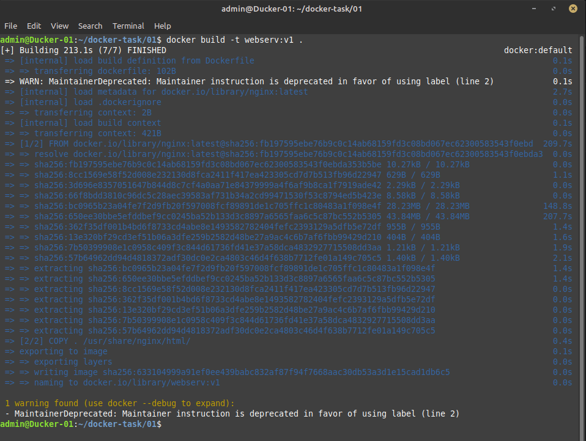
  
- Updating tag and upload it on docker-hub.
  ```bash
  docker tag webserv:v1 tariqmehmoodmalik/test-repo:v1
  docker push tariqmehmoodmalik/test-repo:v1
  ```
  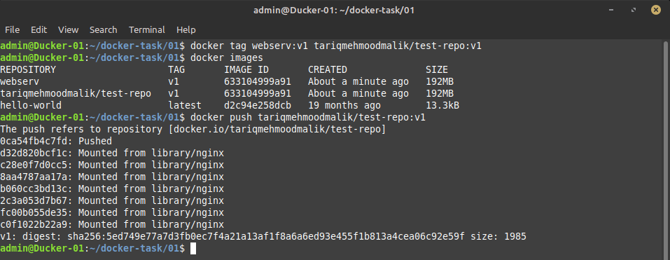

- verifying from Docker-Hub.        
  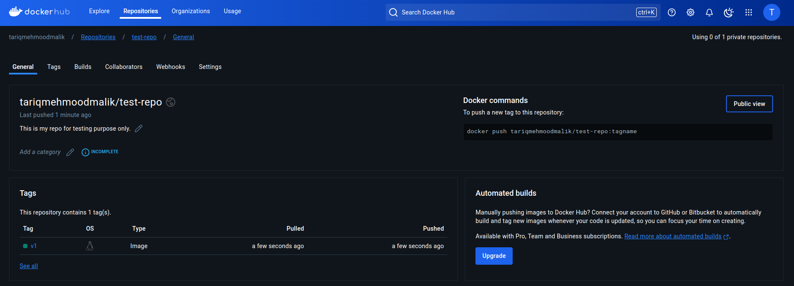
  
---

## Task 2
Create 2 networks of Bridge Type named as `n01` and `w02`. Make two different containers, each in one of the networks.
- Craeting bridge network named `n01`:
  ```bash
  docker network create --driver bridge n01
  docker network ls
  ```
  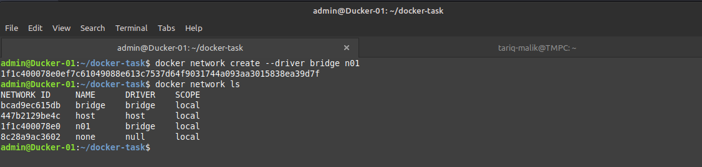
  
- Creating container with `n01` network
  ```bash
  docker run -d --name linux-n01 --net n01 alpine:latest
  docker ps -a
  ```
  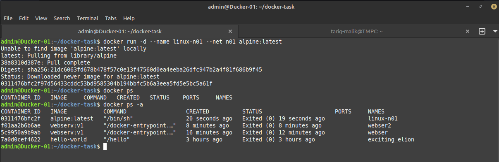
  
- Craeting bridge network named `w01`:
  ```bash
  docker network create --driver bridge w01
  docker network ls
  ```    
  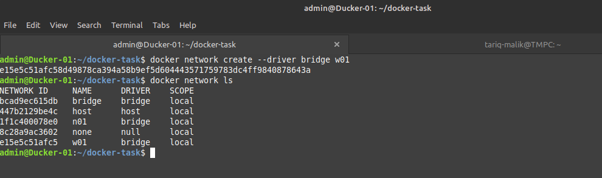
  
- Creating container with `w01` network
  ```bash
  docker run -d -it --name pyth-w01 --net w01 python:slim
  docker ps
  ```
  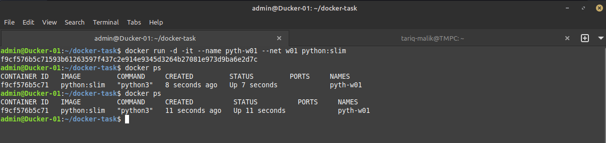
  

---

## Task 3
Using the image from `engineerbaz/dockerlabs`, create a container to show output.

- Pulling image from `engineerbaz/dockerlabs` and making conatiner name `baz-linux`
  ```bahs
  docker pull engineerbaz/dockerlabs:v1
  docker run -dit --name baz-linux -p 8080:80 engineerbaz/dockerlabs:v1
  docker ps
  ```
  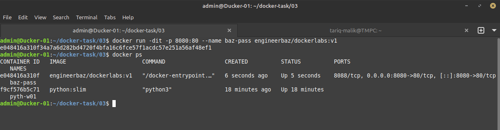

  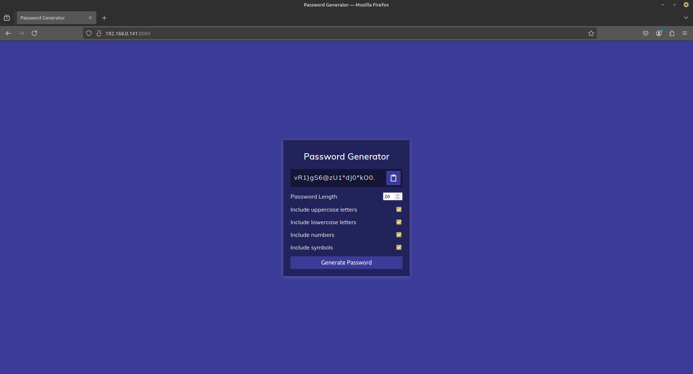
  

---

## Task 4
Get data from [this link](https://github.com/engineerbaz/DevOps-B07-TrainingCourse/blob/main/learningTasks/project-todoList.md) and run it as a project.


- From given link creating `index.html`, `style.css` & `script.js`.
  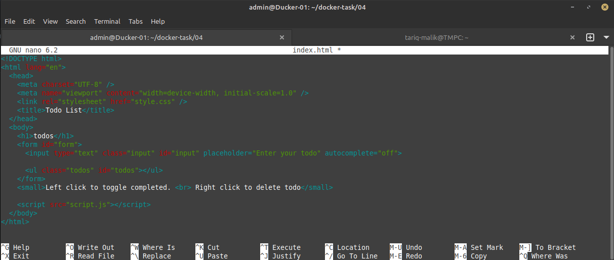

  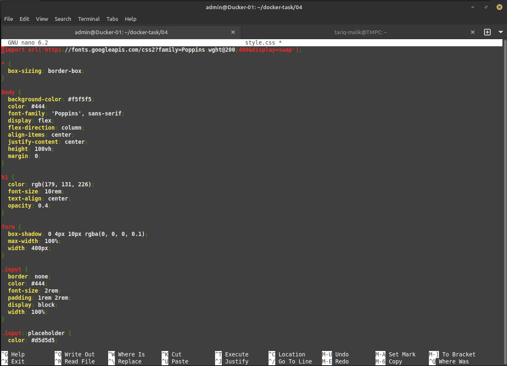

  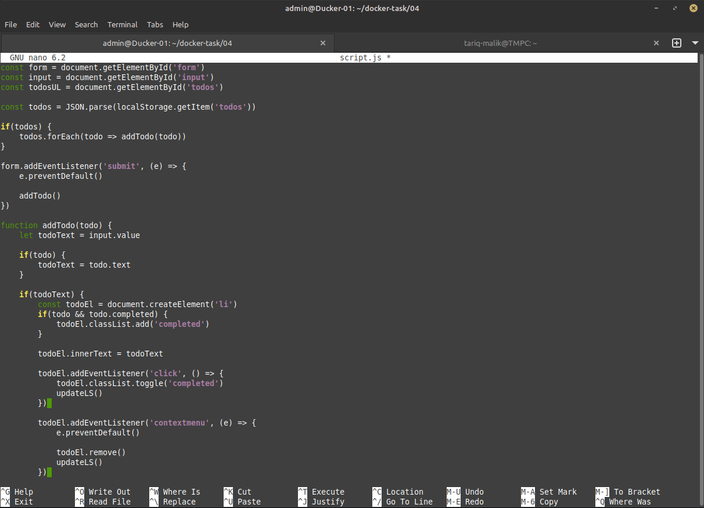


- Creating `Dockerfile` for nginx webserver.
  ```bash
  nano Dockerfile
  ```
  `Dockerfile` content:
  ```
  FROM nginx:latest
  MAINTAINER tariq
  COPY . /usr/share/nginx/html/
  ```

- Builtiding image name `project:v1` and running container name `my-project` on port 8090.
  ```bash
  docker build -t project:v1 .
  docker run -d -p 8090:80 --name my-projcet project:v1 
  ```
  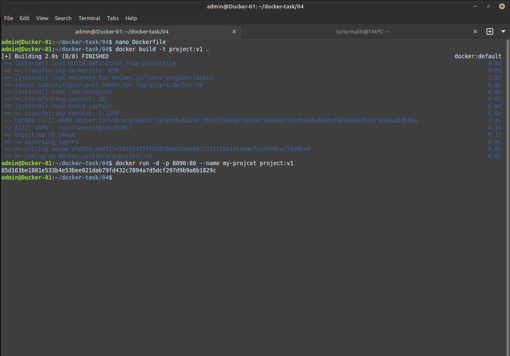

  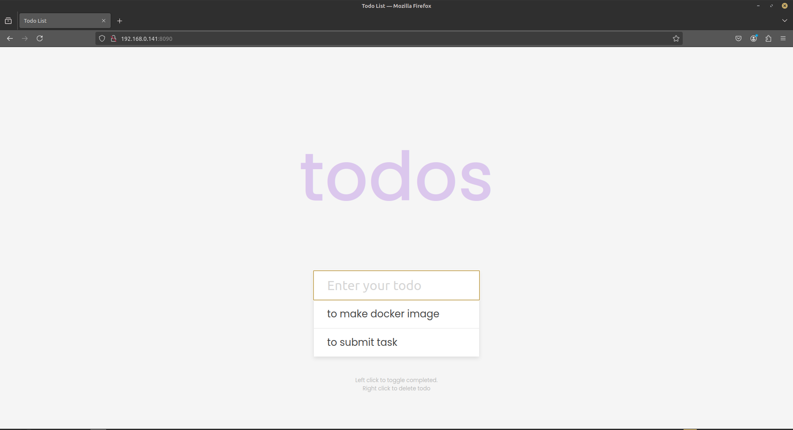

---

## Task 5
Create a file named `Dockerfile` for a modified CentOS (using the official CentOS image as a parent image), which has `figlet`, `ping`, `curl` tools, and a tool of your choice. Save the file and build it. Now, check if the image is present by running `docker images` and start a container.

- Creating `Dockerfile` for task with following content.
  ```html
  FROM centos:latest
  RUN yum -y update && yum install -y figlet && yum isntall -y iputils-ping && yum install -y curl && yum install -y htop 
  ```
- Building and veryfying image
  ```bash
  docker build -t my-centos:1 .
  docker images  
  ```


  Was't able to perform this task as i was getting following error while building image, i have tried multiple things but wasn't able to resolve it will try againg tomorrow. 

  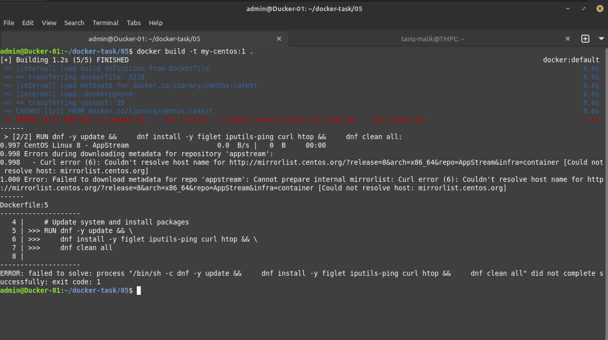

