# Docker Tasks 02

---

### 01 Use https://github.com/dockersamples/example-voting-app.git to build setup (Hint: needs to do troubleshooting).

- Cloning repository to local host.
```bash
git clone https://github.com/dockersamples/example-voting-app.git
```

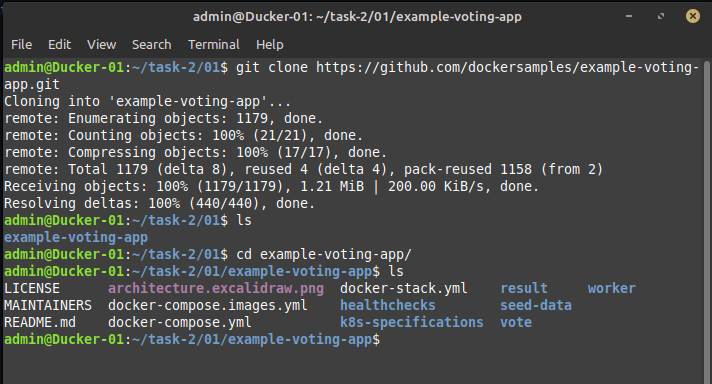

<br>
- Building infrastructure with docker compose (with file with images only).       

```bash
docker compose -f docker-compose.images.yml up -d
docker ps              # Checking container started
docker network ls      # Checking new networks
```

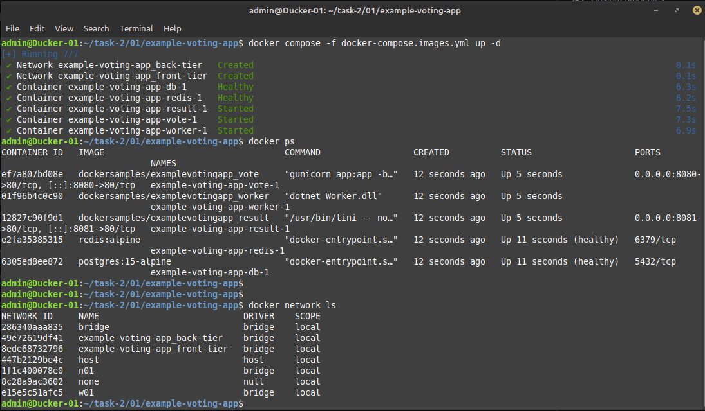

<br>
- Checking Vote app is running or not.

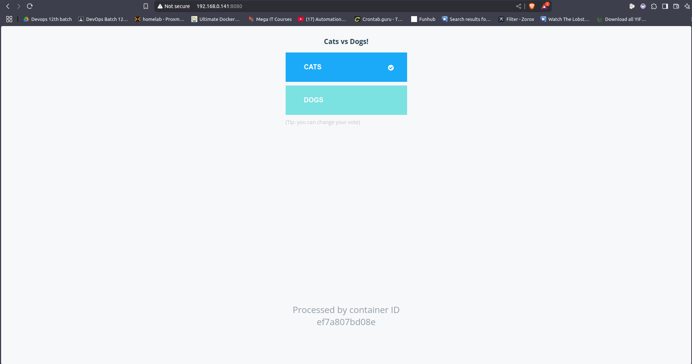

<br>
- Checking voting results.

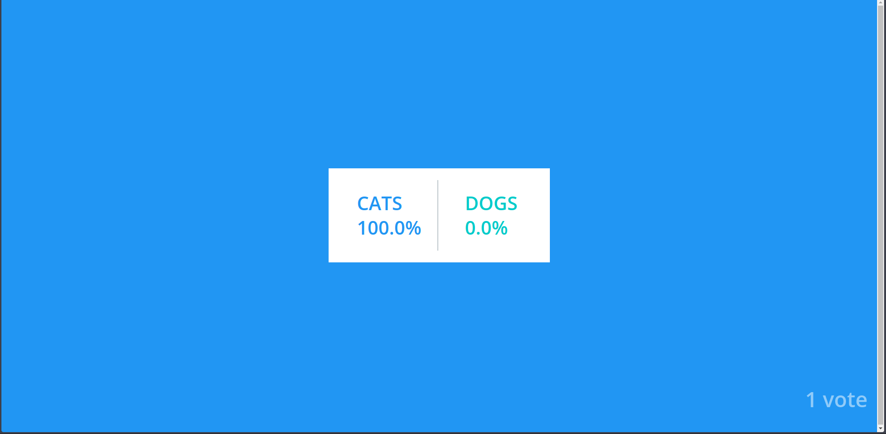

<br>
- Shutting down infrastructure.

```bash
docker compose -f docker-compose.images.yml down
```

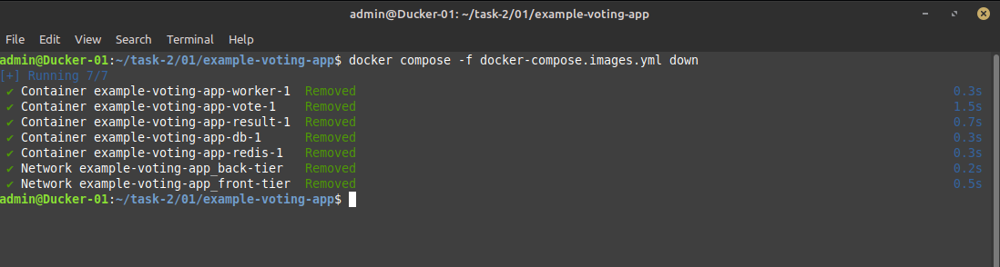

<br>

---

### 02  Create a Multi Container Infrastructure using following instructions

#### a. Linux Machine for pinging Google DNS     
```yaml
ping:
  image: ubuntu
  command: /bin/bash -c "apt-get update && apt-get install -y iputils-ping && ping 8.8.8.8"
```

#### b. A WebServer of Apache on port 8081 using [vote.html at github  engineerbaz/DevOps-Bootcamp-2024}         
```yaml
vote:
  image: httpd
  ports:
    - 8081:80
  volumes:
    - ./vote/index.html:/usr/local/apache2/htdocs/index.html  
```
       
- Vote index.html        
```html 
<html>
  <body>

    <div style='position: relative; padding-bottom: 56.25%; padding-top: 35px; height: 0; overflow: hidden;'><iframe sandbox='allow-scripts allow-same-origin allow-presentation' allowfullscreen='true' allowtransparency='true' frameborder='0' height='315' src='https://www.mentimeter.com/app/presentation/al9jty49ovioh7qovk61nuxz8pzy6qov/embed' style='position: absolute; top: 0; left: 0; width: 100%; height: 100%;' width='420'></iframe></div>

  </body>
</html>
``` 

#### c: Database of your choice      
```yaml
db:
  image: mysql
  restart: always
  ports:
    - 5050:3306
  environment:
    - MYSQL_ROOT_PASSWORD=pass
```

#### d. Webserver of your image built locally printing current time/date and your name      

- My index.html for date, time & Owner name.
```html
<!DOCTYPE html>
<html lang="en">
<head>
  <meta charset="UTF-8">
  <meta name="viewport" content="width=device-width, initial-scale=1.0">
  <title>My Name and Time</title>
  <style>
    body {
      font-family: Arial, sans-serif;
      text-align: center;
      margin-top: 50px;
    }
    h1 {
      color: #333;
    }
    .time {
      font-size: 24px;
      margin-top: 20px;
    }
  </style>
</head>
<body>

  <h1>Hello, my name is <span id="name">Tariq Mehmood</span></h1>
  <div class="time">
    <p>Current date and time:</p>
    <p id="current-time"></p>
  </div>

  <script>
    // Function to get current date and time
    function displayTime() {
      const now = new Date();
      const options = { weekday: 'long', year: 'numeric', month: 'long', day: 'numeric' };
      const date = now.toLocaleDateString('en-US', options);
      const time = now.toLocaleTimeString();

      // Display the date and time on the page
      document.getElementById('current-time').innerText = date + ' - ' + time;
    }

    // Call the function to display the time
    displayTime();

    // Optionally, update the time every second
    setInterval(displayTime, 1000);
  </script>

</body>
</html>
``` 

- Creating Dockerfile for image name `date`              

```dockerfile
FROM nginx

COPY ./date/index.html /usr/share/nginx/html/index.html

EXPOSE 80
```

- Creating local image name `date`

```bash
docker build -t date .
```

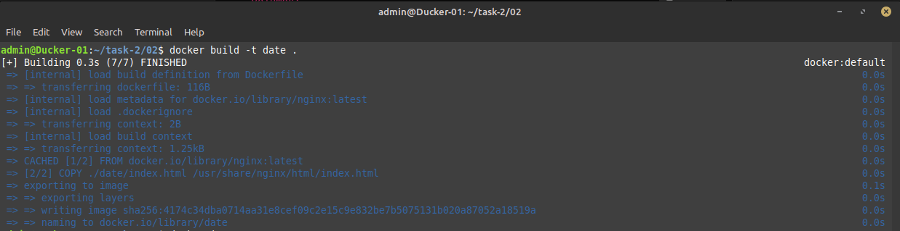

<br><br>
- Docker-Compose Code for my local image

```yaml
  date:
    image: date
    ports:
      - "8082:80"
```


### Complete Docker-compose file
```yaml
version: "3"
services:
  ping:
    image: ubuntu
    command: /bin/bash -c "apt-get update && apt-get install -y iputils-ping && ping 8.8.8.8"
  
  vote:
    image: httpd
    ports:
      - "8081:80"
    volumes:
      - ./vote/index.html:/usr/local/apache2/htdocs/index.html  

  db:
    image: mysql
    restart: always
    ports:
      - "5050:3306"
    environment:
      - MYSQL_ROOT_PASSWORD=pass

  date:
    image: date
    ports:
      - "8082:80"
```

### Results

- Creating infrastructure.
  
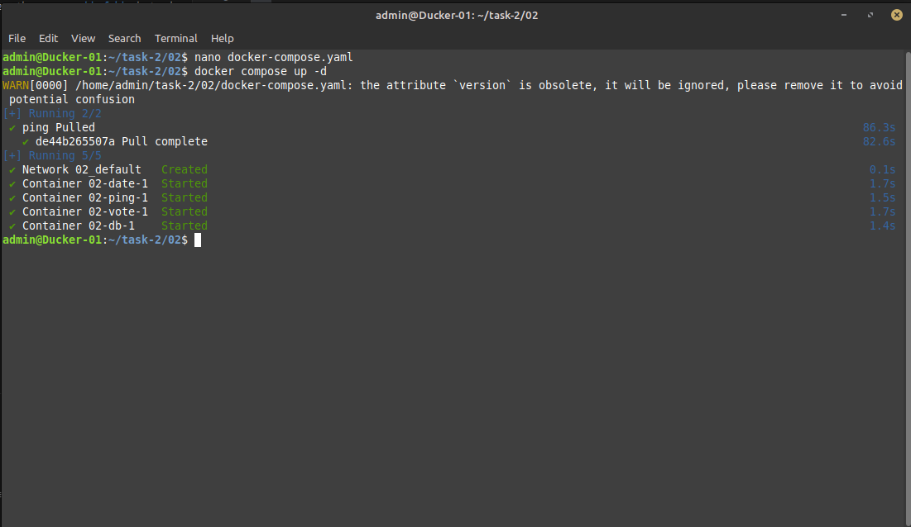

<br><br>
- Vote App on port 8081.
  
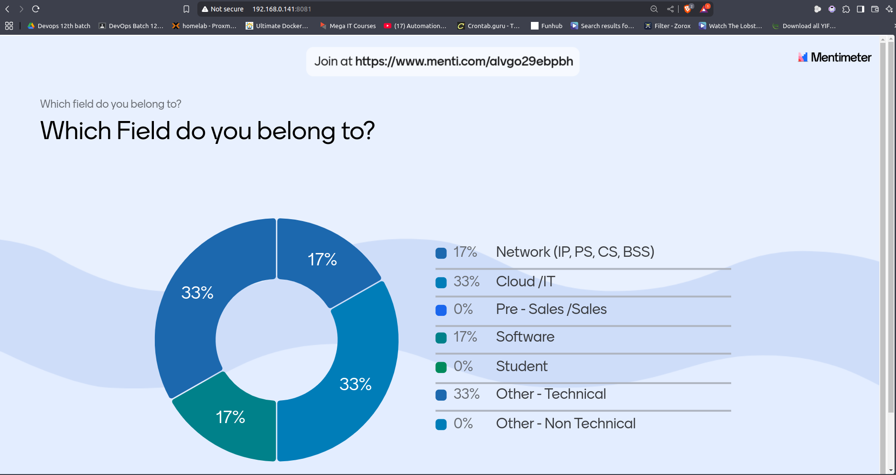

<br><br>

- Date, Time & Owner name App on port 8082.
  
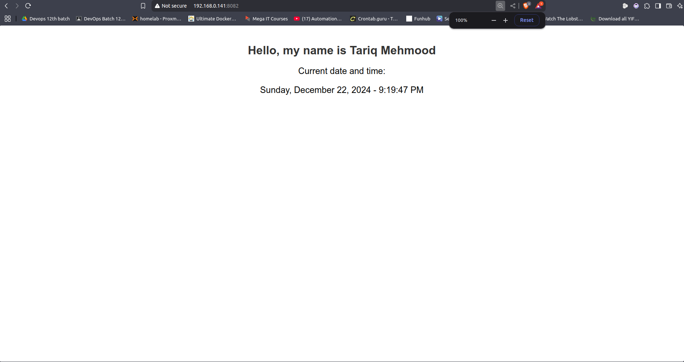

<br><br>
- Ubuntu Ping machine.

```bash
docker logs 02-ping-1
```
  
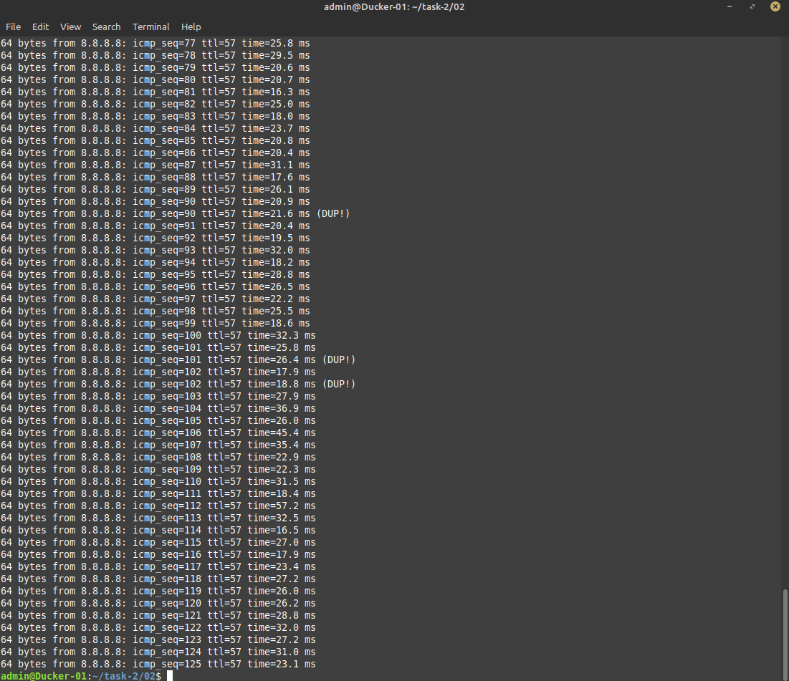

<br><br>
- Logging as root in mysql data base.
  
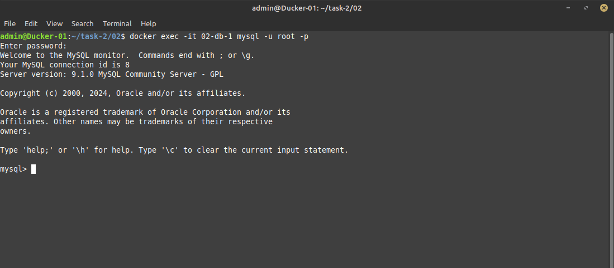

<br><br>
- Removing infrastructure.
  
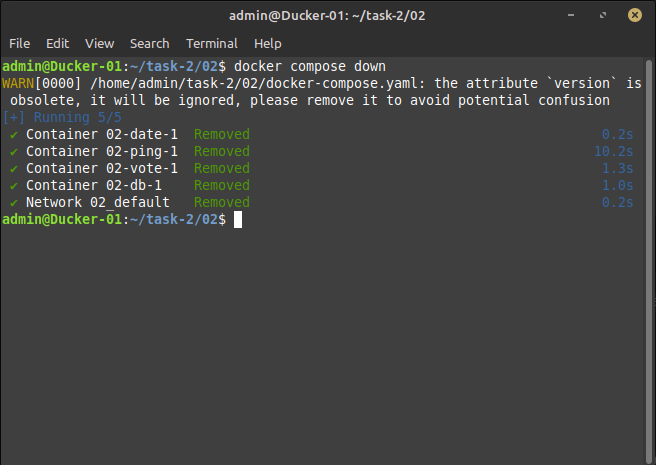

<br>
