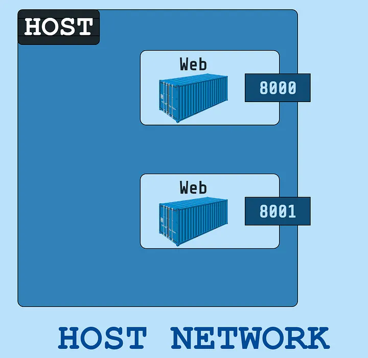
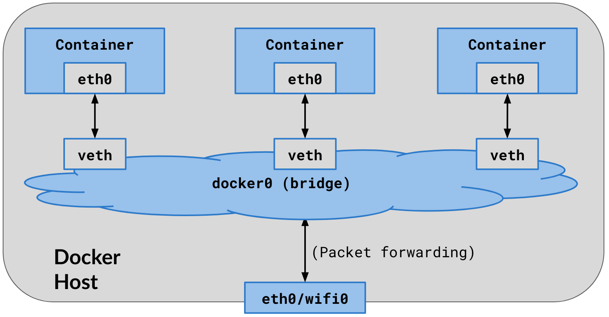

# Docker Networking Overview

The beauty of docker container is isolation not only on process / services level also on network level as well. Docker allows communication between containers and with external networks. It utilizes software-defined networking (SDN) to create virtual networks, providing connectivity while maintaining isolation. This allows users to define custom networks, connect containers to these networks, and establish network policies.         
 
Basic network /driver types in docker:

### 1. Bridge: 
The default network type. It creates a virtual bridge on the host machine, connecting containers to the bridge. Containers on a bridge network can communicate with each other and, by default, access the host's network.        

### 2. Host: 
Containers on the host network share the host's network namespace. They have the same IP address as the host and can directly access the host's network interfaces.    

### 3. None:
This network type disables the container's network stack, isolating it from any network access.   

### 4. Overlay: 
This network type allows communication between containers running on different Docker hosts. It creates a virtual network that spans multiple hosts, enabling inter-host container communication.  

### Docker connect 
It is a command used to add an existing Docker container to a specific network (on same host). By connecting a container to a an other network, it gains the ability to communicate with other containers within that network.

---
Some important concepts:

**Veth (Virtual Ethernet) Pair:**             
  A veth (Virtual Ethernet) pair is a set of two virtual network interfaces. One end resides inside a container's network namespace. The other end is typically connected to the host’s network namespace or a bridge (docker0).
  
**Linux Namespaces:**   
  A namespace in Linux is a feature that isolates system resources such as processes, network interfaces, file systems, and more, allowing them to operate independently within separate environments. Each namespace provides an isolated view of a specific resource, ensuring that processes in different namespaces do not interfere with each other. This isolation is crucial for containerization technologies like Docker, where each containers can have their own independent resources (e.g., network, filesystem, process IDs) while running on the same host system.   
  
**NAT (Network Address Translation):**    
  NAT is used to allow devices to access external networks (like the internet). When a container tries to access an external service (such as a website), the host will perform source NAT (SNAT) to translate the container’s private IP address to the host’s public or routable IP address. The reverse process, called DNAT (Destination NAT), happens when the response returns to the host and is forwarded to the container
  
**Bridge network:**    
  A bridge network in Linux connects multiple network interfaces (like Ethernet or virtual interfaces) to allow them to communicate as if they were on the same physical network. It operates at the data link layer (Layer 2) and is commonly used in virtualization to connect virtual machines to the host network. A bridge works like a software switch, forwarding packets based on MAC addresses. In docker `docker0` is default bridge network for containers.

---
# Docker Networking Expalined

## Host Driver in Docker




The Host network driver in Docker is a networking mode that allows containers to directly use the networking stack of the Docker host machine. When a container is run with the Host network driver, it bypasses Docker’s network abstraction layer and gains direct access to the host’s network interfaces, routing table, and ports. This means that the container shares the same network namespace as the host, using the host’s IP address and network configuration.

If you use the host network mode for a container, that container's network stack isn't isolated from the Docker host (the container shares the host's networking namespace), and the container doesn't get its own IP-address allocated. For instance, if you run a container which binds to port 80 and you use host networking, the container's application is available on port 80 on the host's IP address.

### Pros of Host Driver in Docker:
- `Better performance`: Reduced overhead and faster networking.
- `Simplicity`: No need for port mapping and unified network configuration.
- `Direct resource access`: Containers can use host resources like storage and hardware.
- `Less complexity`: Avoids virtual network overhead.
    
### Cons of Host Driver in Docker:
- `Security risks`: Lack of isolation between containers and host.
- `Port conflicts`: Containers directly share the host’s network, leading to potential port issues.
- `Limited scalability`: Harder to scale across multiple hosts.
- `Resource contention`: Containers may compete with host resources.
- `Less portability`: Tied to the host’s environment, making it harder to move between systems.

<br>
## Bridge Driver in Docker   

Docker's Bridge driver uses several key concepts to manage container networking and enable communication both within the container environment and with external networks. The main components involved are `Veth pairs`, `Linux namespaces`, `NAT`, and the `Bridge network`.



 
One end of the veth pair resides within the container's `network namespace` and acts as the container’s primary network interface (e.g., `eth0`). The other end is connected to the Docker `bridge network` (`defualt docker0`) please note that when user create bridge network its other than `docker0`, which allows the container to communicate with other containers and the host. The veth pair serves as a `virtual cable` connecting the isolated container network to the host’s network stack.

Each container has its own `network namespace`, which includes its own IP address, routing table, and network interfaces. This isolation ensures that containers do not interfere with each other’s network configurations, maintaining a secure and independent networking environment. The container’s network namespace is connected to the host's network via the Docker bridge (`docker0`) and its veth pair.

When a container sends outbound traffic (e.g., to access the internet), Docker performs `SNAT`. This translates the container’s private IP to the host’s public IP. `Destination NAT (DNAT)` is performed when a response comes back to the host, DNAT maps the response to the appropriate container by converting the public IP back to the container’s private IP address.

This ensures that the container can access external services while remaining secure behind the host's IP address.

The `bridge network` in Docker connects containers to the host’s network, allowing them to communicate both with each other and with the outside world. The bridge operates at the `data link layer` (Layer 2), forwarding packets based on `MAC addresses`. Containers on the same bridge network can communicate directly with each other by sending packets to the bridge. The bridge also connects to the host’s network interface, enabling containers to access external resources via NAT.

### **Summary**

The veth pair connects the container’s isolated network namespace to the host's bridge, allowing communication with the host and other containers. Each container operates in its own network namespace, isolating its network configuration from the host and other containers. Docker uses **SNAT** for outbound traffic and **DNAT** for inbound traffic, allowing containers to communicate with external networks using the host’s IP address. The Docker bridge network connects containers to each other and the host, facilitating inter-container communication and providing access to the outside world.

---

## Docker Network Commands

To list all docker networks
```bash
docker network ls
```
<br>

To create new network of driver bridge
```bash
docker network create --driver bridge <netwrok-name>
```
<br>

To inspect network
```bash
docker network inspect <network-name>
```
<br>

To create conatiner in custom network
```bash
docker run -d --net <network-name> nginx
```
<br>

To connect container running in 1 network to an other network also
```bash
docker network connect <new-network-name> <container-name>
```
<br>
