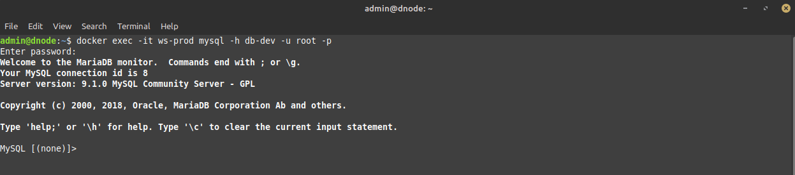
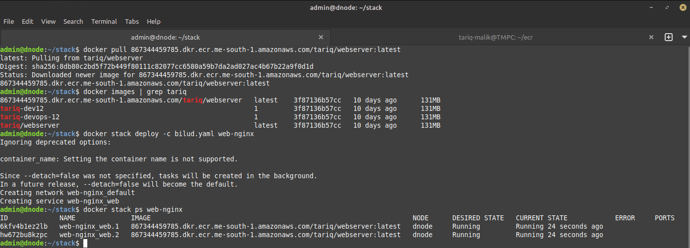
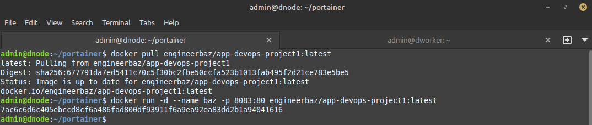
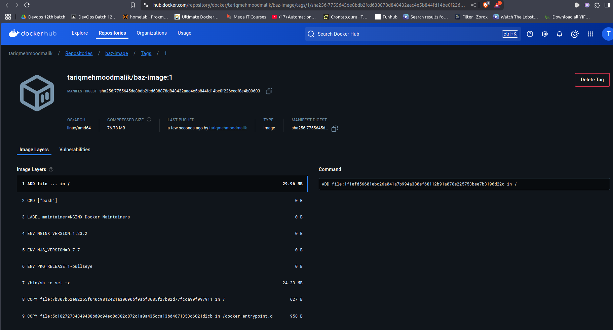

# DOCKER FINAL TASK

## DOCKER NETWORKS

#### 1. Create two networks prod and dev for creating the following containers (Database, website, and a Linux) 

- Creating network `dev` & `prod`.

```bash
docker network create --driver bridge prod
```
```bash
docker network create --driver bridge dev
```

<br><br>

#### 2. Each container should be running in both networks

- Creating Database, website, and a Linux conatiner in both networks
```bash
docker run -d --name db-dev --network dev -e MYSQL_ROOT_PASSWORD=pass -p 3306:3306 mysql
docker run -d --name db-prod --network prod -e MYSQL_ROOT_PASSWORD=pass -p 3307:3306 mysql
```

```bash
docker run -d --name ws-dev --network dev -p 8080:80 nginx
docker run -d --name ws-prod --network prod -p 8081:80 nginx
```

```bash
docker run -d --name l-dev --network dev alpine ping 8.8.8.8
docker run -d --name l-prod --network prod alpine ping 8.8.8.8
```
```bash
docker ps
```


<br><br>

#### 3. The database container of Dev network should be accessible to prod one during migration

- Connecting database container of dev network (db-dev) to prod network for smooth access.

```bash
docker network connect prod db-dev
```

- Installing mysql-client in nginx container to access mysql database.

```bash
docker exec -it wb-prod bash
apt-get update
apt-get install default-mysql-client
```
- Accessing dev-database from prod nginx container.

```bash
docker exec -it ws-prod mysql -h db-dev -u root -p
```


<br><br>


## DOCKER VOLUME

#### 4. Create a named volume pv-0123475

- Creating named volume `pv-0123475` for nginx container and putting sample index.html file in it.
```bash
docker volume create pv-0123475
docker volume ls
sudo -i
cd /var/lib/docker/volumes/pv-0123475/_data
nano index.html
```

<br>


- HTML file code.    
```html
<!DOCTYPE html>
<html lang="en">
<head>
    <meta charset="UTF-8">
    <meta name="viewport" content="width=device-width, initial-scale=1.0">
    <title>Simple Web Page</title>
</head>
<body>
    <header>
        <h1>Welcome to My Website</h1>
    </header>

    <main>
        <section>
            <h2>About Me</h2>
            <p>This is a simple HTML page to showcase a basic structure.</p>
        </section>

        <section>
            <h2>Contact</h2>
            <p>You can reach me at <a href="mailto:example@example.com">example@example.com</a></p>
        </section>
    </main>

    <footer>
        <p>&copy; 2024 Your Name. All rights reserved.</p>
    </footer>
</body>
</html>
```

#### 5. Make /tmp/baz as volume

- Creating directory `/tmp/baz` and creating sample index.html for nginx container.   
```bash
mkdir /tmp/baz
cd /tmp/baz/
nano index.html
```

<br>


```html
<!DOCTYPE html>
<html lang="en">
<head>
    <meta charset="UTF-8">
    <meta name="viewport" content="width=device-width, initial-scale=1.0">
    <title>Simple Web Page</title>
</head>
<body>
    <header>
        <h1>Welcome to My Website</h1>
    </header>

    <main>
        <section>
            <h2>About Me</h2>
            <p>This is a simple HTML page to showcase a basic structure.</p>
        </section>

        <section>
            <h2>Contact</h2>
            <p>You can reach me at <a href="mailto:example@example.com">example@example.com</a></p>
        </section>
    </main>

    <footer>
        <p>&copy; 2024 Your Name. All rights reserved.</p>
    </footer>
</body>
</html>
```

#### 6. Connect volume to three containers and access data, but container03 should only read access.

- Creating nginx container `cont-01` with named volume `pv-0123475`
```bash
docker run -d --name cont-01 -p 8081:80 -v pv-0123475:/usr/share/nginx/html/ nginx
```
- Accessing nginx on localhost.


<br>

- Creating nginx container `cont-02` with volume `/tmp/baz/`
```bash
docker run -d --name cont-02 -p 8082:80 -v /tmp/baz/:/usr/share/nginx/html/ nginx 
```
- Accessing nginx on localhost.


<br>

- Creating nginx container `cont-03` with volume `/tmp/baz/` and read only access.
```bash
docker run -d --name cont-03 -p 8083:80 -v /tmp/baz/:/usr/share/nginx/html/:ro nginx 
```

- Trying to remove file of attached volume in container.   


<br>


## DOCKER COMPOSE

#### 7. You need to run a 3-tier application on a containerized environment containing (mongo, nginx and Redis) and you will take help of Docker Compose, but with following conditions

#### a) Web container should be built with own image showing your name & Batch details

- I dont know how to code and integrate these 3 applications but i am making docker-compose.yaml with my knowledge to create required 3 containers.

- Creating web imagename `tariq-devops-12:1` from Dockerfile with custome `index.html`.

```dockerfile                                                                    
FROM ubuntu:latest

RUN apt-get update && apt-get install -y nginx

COPY index.html /var/www/html/index.html

EXPOSE 80
    
CMD ["nginx", "-g", "daemon off;"]
```

```bash
docker build -t tariq-devops-12:1 .
```


<br>

#### b) mongo db can be run directly  &  c) redis should run on image which is one version below latest

- Creating docker-compose.yaml, using older version of mongo as newer version required `CPU with AVX` which is causing conatiner to crashes.

```yaml
version: '3.7'
services:
  web:
    image: tariq-devops-12:1
    container_name: web_tariq
    ports:
      - 8080:80

  db:
    image: mongo:4.4
    container_name: app_mongo
    restart: always
    ports:
      - 27017:27017
    volumes:
      - db_volume:/data/db
    environment:
      - MONGO_INITDB_ROOT_USERNAME=root
      - MONGO_INITDB_ROOT_PASSWORD=rootpass
      - MONGO_INITDB_DATABASE=myappdb

  cache:
    image: redis:7.2
    container_name: cache_cont
    ports:
      - "6379:6379"
    volumes:
      - redis_volume:/data
    restart: always     

volumes:
  db_volume:
  redis_volume:
```

```bash
docker compose up -d
```


<br>


## DOCKER SWARM

#### 8)Install Docker Swarm and deploy 3 containers

- Initialing docker swarm.
```bash
docker swarm init
```


<br>


- Joining worker node to swarm cluster
```bash
docker swarm join --token <token-id> 192.168.0.170:2377
```


<br>

- Checking nodes list
```bash
docker node ls
```


<br>


- Creating docker swarm stack with 3 containers.
```yaml
 version: '3.7'

services:
  web:
    image: nginx
    ports:
      - 8080:80
    deploy:
      replicas: 2

  db:
    image: mongo:4.4
    ports:
      - 27017:27017
    volumes:
      - db_volume:/data/db
    environment:
      - MONGO_INITDB_ROOT_USERNAME=root
      - MONGO_INITDB_ROOT_PASSWORD=rootpass
      - MONGO_INITDB_DATABASE=myappdb
    deploy:
      replicas: 2

  cache:
    image: redis:7.2
    ports:
      - "6379:6379"
    volumes:
      - redis_volume:/data
    deploy:
      replicas: 2

volumes:
  db_volume:
  redis_volume:
```

```bash
docker stack deploy -c stack.yaml applications
docker stack services applications
docker stack ps applications
```


<br>

#### 9) We need to create a web container but image can not be downloaded from Docker hub or local

- Building custom image from `Dockerfile`.

```dockerfile                                                                    
FROM ubuntu:latest

RUN apt-get update && \
    apt-get install -y nginx && \
    apt-get clean

COPY index.html /var/www/html/index.html

EXPOSE 80
    
CMD ["nginx", "-g", "daemon off;"]
```

```bash
docker build -t tariq-dev12:1 .
```


<br>

- Creating yaml file for above task to build image and deploy nginx conatiner with 2 replicas

```yaml
version: '3.7'

services:
  web:
    image: tariq-dev12:1
    ports:
      - "8080:80"
    deploy:
      replicas: 2
```

```bash
docker stack deploy -c bilut.yaml web-nginx
docker stack services web-nginx
```


<br>

#### 10) Install Portainer and deploy any two Application from templates list

- Creating yaml file portainer.
```yaml
ersion: '3.7'

services:
  portainer:
    image: portainer/portainer-ce:latest
    container_name: portainer
    ports:
      - "9000:9000"
      - "9443:9443"
    volumes:
      - portainer_data:/data
      - /var/run/docker.sock:/var/run/docker.sock
    deploy:
      replicas: 1
      restart_policy:
        condition: on-failure
    networks:
      - portainer_network

volumes:
  portainer_data:
    driver: local

networks:
  portainer_network:
    driver: overlay
```

```bash
docker stack deploy -c portainer.yaml portainer
```


<br>
<br>


<br>


- Installing 2 apps from templates.


<br>


<br>


<br>

## MISC

#### 11) We have 17 containers and we are unable to manage it properly, as a DevOps Engineer what is your suggestion

I would suggest using an orchestration tool like `Docker Swarm` to easily control, deploy, and scale multiple containers / applications by utilizing a multi-node infrastructure along with custom backup strategy to ensures high availability and scalability. Also using a GUI tool like `Portainer` to efficiently view, diagnose and manage nodes / cluster and containers.

#### 12) Use Image (https://hub.docker.com/repository/docker/engineerbaz/app-devops-project1/) and test a container, but add another package of your choice and rebuilt the image to push on the registry

- Pulling the image and making container to test image
```bash
docker pull engineerbaz/app-devops-project1:latest
docker run -d --name baz -p 8083:80 engineerbaz/app-devops-project1:latest
```


<br>


<br>

- Adding `ping` package in image through `Dockerfile` and buidling new image named `tariqmehmoodmalik/baz-image:1` to push to Docker-Hub.

```dockerfile
FROM engineerbaz/app-devops-project1:latest

RUN apt-get update && apt-get install -y iputils-ping

EXPOSE 80
```

```bash
docker build -t tariqmehmoodmalik/baz-image:1 .
```


<br>

  
- Running conatiner from new image to check if `ping` command is running.

```bash
docker run -d --name tariq-baz -p 8084:80 tariqmehmoodmalik/baz-image:1
docker exec -it tariq-baz bash
ping 8.8.8.8
```


<br>

- Pushig image to Docker-Hub

```bash
docker push tariqmehmoodmalik/baz-image:1
```


<br><br>



<br>


#### 13) Get data from https://github.com/engineerbaz/DevOps-B07-TrainingCourse/blob/main/learningTasks/project-todoList.md and run as a project

- From given link created `index.html`, `style.css` & `script.js`.

- Creating `Dockerfile` for webserver.

```dockerfile
FROM nginx:latest
MAINTAINER tariq
COPY . /usr/share/nginx/html/
EXPOSE 80
```

- Builtiding image name `project:v1` and running container name `my-project` on port 8090.
```bash
docker build -t to-do:1 .
docker run -d -p 8090:80 --name my-projcet to-do:1
```
  

<br>


<br>

