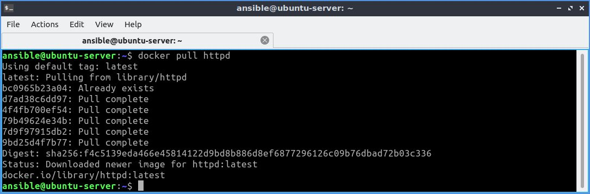
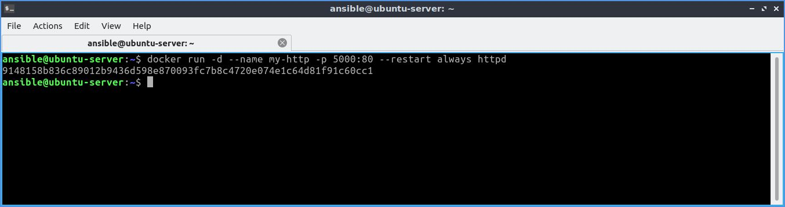
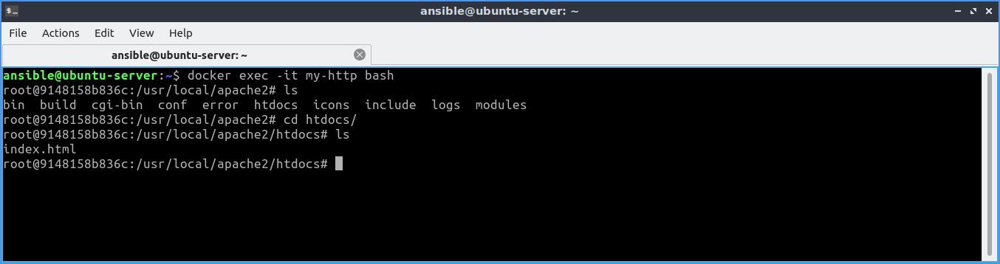
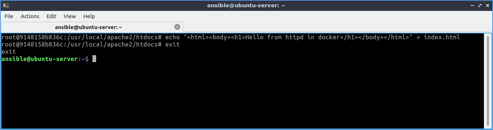
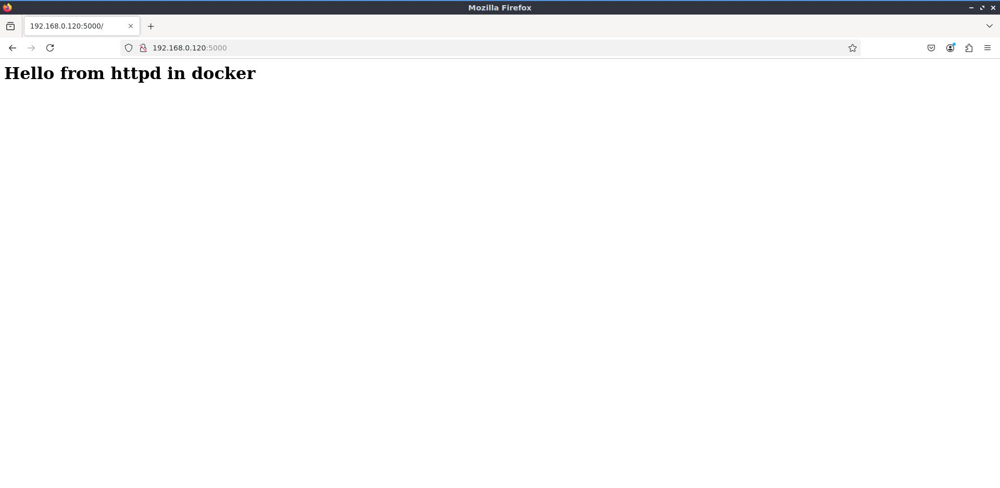

# Building a website on HTTPD

**Task:**
Spin up an HTTPD container listening on port 5000 of the host insure the container is set to always start/restart automatically. Inside the container create a file named index.html inside the container within the httpd DocumentRoot folder containing the following text
```
<html>
<body>
<h1>Hello from httpd in docker</h1>
</body>
</html>
```

---
1. Pulling httpd latest image from Docker Hub.
  ```bash
  docker pull httpd
  ```      
         <br><br><br>
2. Building container of name `my-http` in detached mode from image `httpd` and hosting it on port `5000` and enabling autostart/ restart as always.
  ```bash
  docker run -d --name my-http -p 5000:80 --restart always httpd
  ```       
     <br><br><br>

3. Opening container `my-http` interactive shell as bash and moving to location where default `index.html` is presenet.
  ```bash
  docker exec -it my-http bash
  cd htdocs/
  ls
  ```              
     <br><br><br>
4. Modefying `index.html` content and exiting from container bash shell.
  ```bash
  echo "<html><body><h1>Hello from httpd in docker</h1></body></html>" > index.html
  ```             
     <br><br><br>
5. Verifying chages made in `index.html` through browser `http://192.168.0.120:5000`.             
     <br><br><br>
