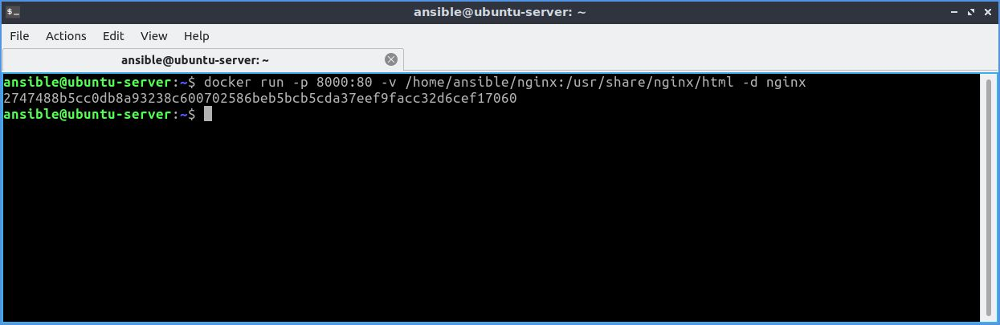
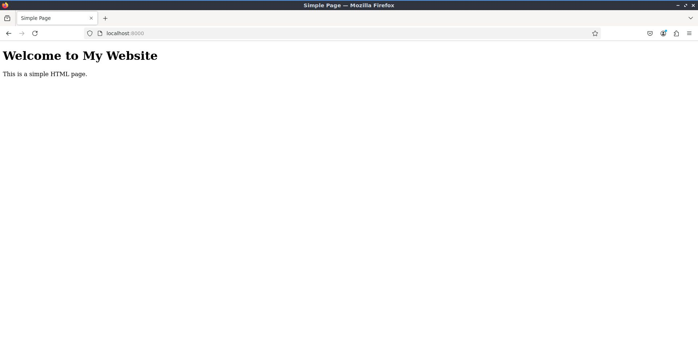

---
# Building a website on Nginx

1. Making custom `index.html` for website.
  ```html
  <!DOCTYPE html>
  <html lang="en">
  <head>
      <meta charset="UTF-8">
      <meta name="viewport" content="width=device-width, initial-scale=1.0">
      <title>Simple Page</title>
  </head>
  <body>
      <h1>Welcome to My Website</h1>
      <p>This is a simple HTML page.</p>
  </body>
  </html>
  ```
2. Pulling nginx latest image fron Docker Hub.
  ```bash
  docker pull ngix
  ```
         
2. Building the container from image on port 8000 with custom `index.html`.
  ```bash
  docker run -p 8000:80 -v /home/ansible/nginx:/usr/share/nginx/html -d nginx
  ```
     
3. Verying website by entering `localhost:8000` in browser.         
     

